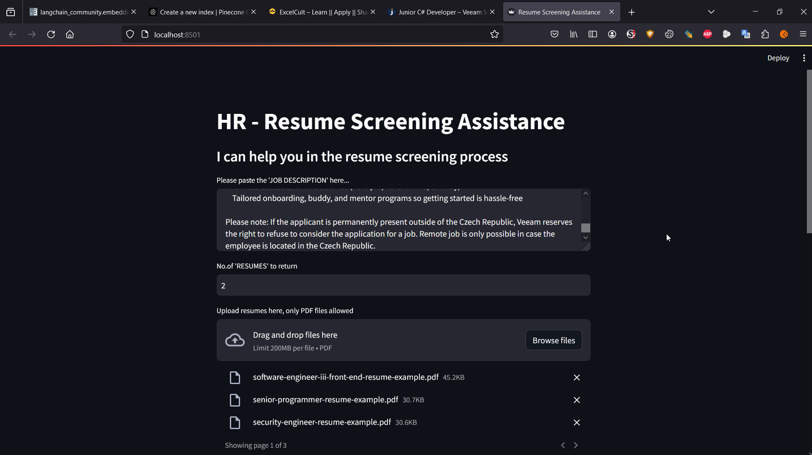

# About
An app that can take a job description as input parameter as well as multiple CVs and find the most suitable
candidates via a match rating. Uses Huggingface API to get an Embedding model and Pinecone as Vector store.

## 1. Create venv
``python3 -m venv venv``

## 2. Activate venv
``source venv/bin/activate``
OR
``venv\Scripts\activate``

## 3. Install dependencies
``pip install -r requirements.txt``

## 4. Start app
``streamlit run app.py``

## 5. Use app
- Paste job description
- Upload CVs
- Analyse
